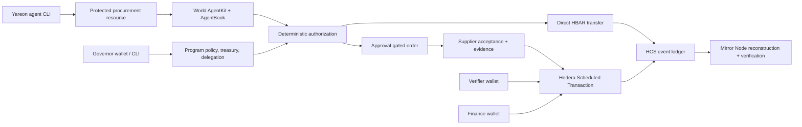

# Yareon

**Human-backed AI procurement with policy-controlled HBAR settlement on
Hedera.**

Yareon lets an organization delegate a bounded purchasing budget to an AI
agent without giving that agent unrestricted treasury access. World AgentKit
proves that the executing agent is backed by a real, unique human. Yareon then
applies deterministic procurement policy and settles an approved purchase on
Hedera testnet.

The tested implementation includes two real payment paths:

- a direct agent-triggered `0.1 HBAR` treasury-to-supplier transfer; and
- a delivery-gated `0.1 HBAR` Hedera Scheduled Transaction controlled by
  distinct verifier and finance accounts.

There are no application smart contracts and no Solidity.

> **Demo video:** add the final public ≤5-minute video URL here before
> submission.

## Judge quick links

- [Complete testnet execution log](docs/qualification-e2e-log.md) — commands,
  accounts, programs, HCS sequences, signatures, transactions, and independent
  verification results
- [≤5-minute recording checklist](docs/submission-checklist.md)
- [World AgentKit integration](docs/world-agentkit.md)
- [World staging integration feedback](docs/world-agentkit-staging-feedback.md)
- [Role and authority separation](docs/role-separation.md)
- [Protocol and event semantics](docs/protocol-v0.md)
- [Agent skills](agent-skills/README.md)
- [Agent CLI](packages/cli/README.md)
- [Public GitHub repository](https://github.com/dimast-x/ethgloballisbon)

## Live proof

| Artifact | Public evidence |
|---|---|
| HCS event ledger | [Topic `0.0.9751463`](https://hashscan.io/testnet/topic/0.0.9751463) |
| World agent | `0x97679cc5ED6BcEF8Ea807676AAE8E6178e4C88E0` |
| AgentBook registration | [Base Sepolia transaction](https://sepolia.basescan.org/tx/0x6c65bf2db225655d2ac24ed017a79bb6747b4c58d6c08d5c8a0aacbaac6ce6a9) |
| Direct AgentKit program | `program_ad3ae3409d0b` |
| Direct agent order | `order_b482feba5457` |
| Direct HBAR payment | [Hashscan transaction](https://hashscan.io/testnet/transaction/0.0.9708339%401785045836.532109133) |
| Approval-gated program | `program_28f2637a58be` |
| Approval-gated order | `order_2f7baf8eec46` |
| 2-of-2 payment schedule | [Schedule `0.0.9763828`](https://hashscan.io/testnet/schedule/0.0.9763828) |
| Scheduled HBAR payment | [Hashscan transaction](https://hashscan.io/testnet/transaction/0.0.9708339%401785046307.224950527%3Fscheduled) |

The verifier reconstructs both programs from Mirror Node, checks World
AgentKit evidence, verifies the expected rejection, confirms each required
schedule signer, and finds the exact `10,000,000` tinybar treasury debit and
supplier credit. See the
[full evidence log](docs/qualification-e2e-log.md#hedera-verification).

## Prize qualification

### World — AgentKit New Use Cases

| Requirement | How Yareon satisfies it | Proof |
|---|---|---|
| Uses AgentKit meaningfully | The protected procurement resource returns a short-lived AgentKit `402` challenge. The dedicated agent signs the exact intent with EIP-191 and Yareon validates freshness, URI binding, signer address, and AgentBook registration. | [`procure` route](app/api/agents/agentkit/procure/route.ts), [AgentKit adapter](src/adapters/agentkit.ts) |
| Verifies human backing before granting rights | An unsigned bot is rejected before an order exists. Only the registered human-backed agent reaches policy evaluation and order creation. | [Execution log](docs/qualification-e2e-log.md#agent-procurement) |
| Human backing changes authorization | The verified agent receives only its delegated program, action, category, per-order, total-spend, and validity rights. A correctly signed request above `0.2 HBAR` is rejected with `AGENT_ORDER_LIMIT_EXCEEDED`. | [Agent authorization service](src/application/agentkit.ts), [policy service](src/application/service.ts) |
| Working end-to-end flow | The verified agent discovers an eligible offer, creates an order, and causes a real `0.1 HBAR` supplier payment on Hedera testnet. | [Direct payment](https://hashscan.io/testnet/transaction/0.0.9708339%401785045836.532109133), [command log](docs/qualification-e2e-log.md#commands-executed) |
| Genuinely new trust model | Human backing is used for bounded organizational purchasing, not generic login, content generation, discounts, or reputation. It is necessary but not sufficient: deterministic treasury policy still controls execution. | [Implemented system reference](project.md) |

Yareon targets **AgentKit New Use Cases**. It does not claim the Selfie Check
or Identity Check tracks.

### Hedera — AI & Agentic Payments

| Requirement | How Yareon satisfies it | Proof |
|---|---|---|
| AI agent executes a financial operation on testnet | A World-backed delegated agent selects an approved service and its signed order command executes a native `0.1 HBAR` treasury-to-supplier transfer. | [Direct payment](https://hashscan.io/testnet/transaction/0.0.9708339%401785045836.532109133) |
| Uses qualifying agentic tooling or Hedera SDK | Yareon uses World AgentKit for agent authentication and `@hashgraph/sdk` directly for accounts, HCS, transfers, schedules, and queries. | [Hedera adapter](src/adapters/hedera.ts), [AgentKit adapter](src/adapters/agentkit.ts) |
| Public source with setup, architecture, and payment flow | This README contains each item and links to the protocol, implementation map, and reproducible evidence. | [Architecture](#architecture), [run locally](#run-locally), [payment flows](#tested-payment-flows) |
| ≤5-minute demo | The repository includes a timed recording plan. The final video URL must be inserted above before submission. | [Recording checklist](docs/submission-checklist.md) |

Implemented optional enhancements:

- Scheduled Transactions for approval-gated settlement
- HCS-based verifiable payment and policy audit trail
- role-scoped CLI automation for governor, agent, supplier, verifier, and
  finance workflows

Yareon does not claim x402, OpenClaw ACP, A2A, HCS-14, UCP, HTS, or
Hedera Agent Kit usage.

### Hedera — “No Solidity Allowed”

| Requirement | How Yareon satisfies it | Proof |
|---|---|---|
| Hedera JavaScript/TypeScript SDK; no Solidity | Network operations use `@hashgraph/sdk`. The repository contains no Solidity contracts. | [Hedera adapter](src/adapters/hedera.ts), [`package.json`](package.json) |
| At least two native Hedera services | HCS stores the append-only protocol log; Scheduled Transactions enforce 2-of-2 release; native CryptoTransfer moves HBAR; Mirror Node reconstructs and verifies state. | [HCS topic](https://hashscan.io/testnet/topic/0.0.9751463), [schedule](https://hashscan.io/testnet/schedule/0.0.9763828) |
| Working application and coherent UX | Separate Governor and Member surfaces expose only their permitted actions; the agent has a headless equivalent through the CLI and skills. | [Role separation](docs/role-separation.md), [agent skills](agent-skills/README.md) |
| Public source with setup and usage | Local setup, environment variables, CLI usage, architecture, and verification are documented below. | [Run locally](#run-locally), [verification](#reproduce-the-verification) |
| ≤5-minute demo | The timed recording plan covers creation, agent execution, schedule approval, settlement, and audit proof. | [Recording checklist](docs/submission-checklist.md) |

Implemented optional enhancements:

- Mirror Node REST integration
- creative use of HCS for policy decisions, identity references, delivery
  evidence, approvals, and settlement history
- explicit key isolation, role separation, bounded delegation, replay
  protection, and server-side transaction verification

## Tested payment flows

### 1. Direct agentic settlement

1. The governor funds a dedicated program treasury with `1 HBAR`.
2. The agent reads only policy-eligible offers and previews a `0.1 HBAR`
   service.
3. An unsigned request receives an AgentKit `402` challenge.
4. The registered agent signs the exact request.
5. Yareon checks World human backing and the agent's delegation.
6. A request above the per-order limit is rejected and written to HCS.
7. The valid order executes one native HBAR transfer from the program treasury
   to the independent supplier.
8. Mirror Node confirms the exact debit and credit.

### 2. Delivery- and approval-gated settlement

1. The governor creates a second treasury whose key is a 2-of-2 Hedera
   `KeyList` for separate verifier and finance accounts.
2. The World-backed agent creates the `0.1 HBAR` order.
3. The supplier independently accepts it, causing Yareon to create Hedera
   schedule `0.0.9763828`.
4. The supplier submits a SHA-256 delivery-evidence reference.
5. The verifier signs the schedule from `0.0.9763643`.
6. Finance signs from distinct account `0.0.9763644`.
7. Hedera executes the scheduled treasury-to-supplier transfer automatically
   after the second required signature.
8. HCS records the lifecycle and Mirror Node reconstructs the final
   `PAYMENT_EXECUTED` state.

## Architecture



Implementation map:

- [`src/protocol`](src/protocol) — money types, policy, events, state reducer,
  orders, delegations, and evidence
- [`src/application`](src/application) — commands, authorization, identity
  binding, role checks, funding reconciliation, and orchestration
- [`src/adapters/agentkit.ts`](src/adapters/agentkit.ts) — World challenge and
  AgentBook verification boundary
- [`src/adapters/hedera.ts`](src/adapters/hedera.ts) — HCS, transfers,
  schedules, signer verification, and Mirror Node integration
- [`app`](app) — Next.js Governor and Member experiences and protected APIs
- [`packages/cli`](packages/cli) — headless agent interface
- [`agent-skills`](agent-skills) — governor and procurement-agent operating
  instructions

## Security and privacy

- Private keys never appear in HCS, API responses, connection files, or the
  evidence log.
- The server stores only the public World agent address; the agent signing key
  stays in the agent environment.
- Raw World human identifiers are not persisted. HCS receives only a SHA-256
  verification reference, public agent address, method, and expiry.
- Program funding is credited only after Mirror Node confirms the exact
  depositor, treasury, amount, memo, and successful transaction.
- Verifier and finance approvals are accepted only after Hedera confirms the
  correct account signed the correct schedule.
- Buyer, offer, supplier, category, amount, and remaining capacity are derived
  and checked server-side.
- Idempotency keys and one-time AgentKit challenges prevent duplicate execution
  and replay.

More detail: [role separation](docs/role-separation.md) and
[protocol semantics](docs/protocol-v0.md).

## Run locally

Prerequisites:

- Node.js `>=22.13`
- Hedera testnet operator account and private key
- Hedera testnet HCS topic
- WalletConnect project ID for browser wallet actions
- dedicated World agent key whose public address is registered in AgentBook

Install and configure:

```bash
npm install
cp .env.example .env.local
npm run setup:testnet
npm run dev
```

Populate the variables documented in [`.env.example`](.env.example). Keep
`HEDERA_OPERATOR_KEY`, `YAREON_AUTH_SECRET`, and
`WORLD_AGENT_PRIVATE_KEY` server- or agent-side only. The public app never
falls back to simulated data when live configuration is absent.

Application entries:

- Governor: `http://localhost:3000/governor`
- Human member: `http://localhost:3000/member?programId=<program-id>`
- Agent: use the CLI below

## Agent CLI and skills

Build the local CLI:

```bash
npm run build:cli
```

Check a connected program, inspect eligible offers, preview, and execute:

```bash
node packages/cli/dist/cli.cjs doctor \
  --base-url http://localhost:3000 \
  --program-id <program-id>

node packages/cli/dist/cli.cjs offers \
  --base-url http://localhost:3000 \
  --program-id <program-id>

node packages/cli/dist/cli.cjs buy \
  --base-url http://localhost:3000 \
  --program-id <program-id> \
  --offer-id <offer-id>

node packages/cli/dist/cli.cjs buy \
  --base-url http://localhost:3000 \
  --program-id <program-id> \
  --offer-id <offer-id> \
  --execute
```

The installable [`yareon-agent`](agent-skills/yareon-agent/SKILL.md) and
[`yareon-governor`](agent-skills/yareon-governor/SKILL.md) skills preserve the
same role boundaries. See the [skill catalog](agent-skills/README.md).

## World AgentKit configuration

Generate a dedicated 32-byte key outside the repository and keep it only in the
agent environment:

```bash
openssl rand -hex 32
npm run agentkit:address
```

Configure the printed public value as `WORLD_AGENT_ADDRESS` on the server,
register it through the World AgentKit flow, and validate:

```bash
npx @worldcoin/agentkit-cli register <agent-address>
npm run agentkit:validate
```

The completed hackathon run used the World staging simulator and AgentBook on
Base Sepolia:

```text
AGENTBOOK_RPC_URL=https://sepolia.base.org
AGENTBOOK_CONTRACT_ADDRESS=0xA23aB2712eA7BBa896930544C7d6636a96b944dA
AGENTBOOK_NETWORK=base-sepolia
```

See [World integration details](docs/world-agentkit.md) and the
[integration feedback report](docs/world-agentkit-staging-feedback.md).

## Reproduce the verification

Run the public ledger verifier against both completed programs:

```bash
npm run verify:live -- program_ad3ae3409d0b
npm run verify:live -- program_28f2637a58be
npm run audit:cli -- program_28f2637a58be testnet
```

Expected high-level results:

- direct program: `verified: true`, `DIRECT_AGENT_PAYMENT`,
  `exactTransferVerified: true`
- approval program: `verified: true`, `SCHEDULED_PAYMENT`, two approvals,
  `exactTransferVerified: true`

The complete sanitized command record and outputs are in the
[qualification log](docs/qualification-e2e-log.md).

## Release checks

```bash
npm run typecheck
npm test
npm run lint
npm run build:cli
npm run test:site
```

The live Hedera golden-run test is opt-in because it reads testnet:

```bash
RUN_HEDERA_TESTNET=1 \
HEDERA_TEST_PROGRAM_ID=program_28f2637a58be \
npm run test:testnet
```

Latest completed result:

- unit/integration tests: `54` passed
- live Hedera test: `1` passed
- rendered production checks: `3` passed
- TypeScript, ESLint, CLI build, and Next.js production build: passed

## Repository documentation

| Document | Purpose |
|---|---|
| [`project.md`](project.md) | Concise implemented-system reference |
| [`docs/qualification-e2e-log.md`](docs/qualification-e2e-log.md) | Public testnet artifacts and exact command record |
| [`docs/submission-checklist.md`](docs/submission-checklist.md) | Evidence checklist and timed demo plan |
| [`docs/world-agentkit.md`](docs/world-agentkit.md) | AgentKit request, privacy, and verification flow |
| [`docs/world-agentkit-staging-feedback.md`](docs/world-agentkit-staging-feedback.md) | World team integration feedback |
| [`docs/role-separation.md`](docs/role-separation.md) | Governor, member, agent, supplier, verifier, and finance boundaries |
| [`docs/protocol-v0.md`](docs/protocol-v0.md) | Event protocol, policy, evidence, and settlement semantics |

## Submission scope

Yareon is submitting for:

1. World — **AgentKit New Use Cases**
2. Hedera — **AI & Agentic Payments**
3. Hedera — **“No Solidity Allowed” — Build with Hedera SDKs**
